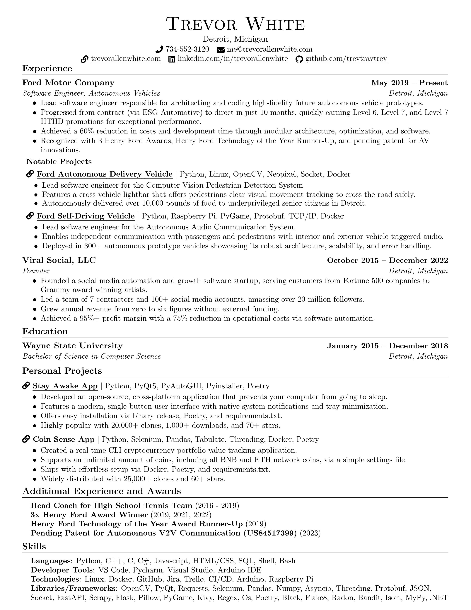

# resume
My resume (using LaTeX).

## To Use:
- Create new blank project on https://www.overleaf.com/
- upload resume.tex

  

## Inspired by:
- https://www.overleaf.com/latex/templates/jakes-resume-anonymous/cstpnrbkhndn
- https://www.careercup.com/resume
- https://www.levels.fyi/blog/applying-star-method-resumes.html
- https://www.reddit.com/r/cscareerquestions/comments/1577dm9/the_ultimate_guide_to_writing_your_resuume_for/
